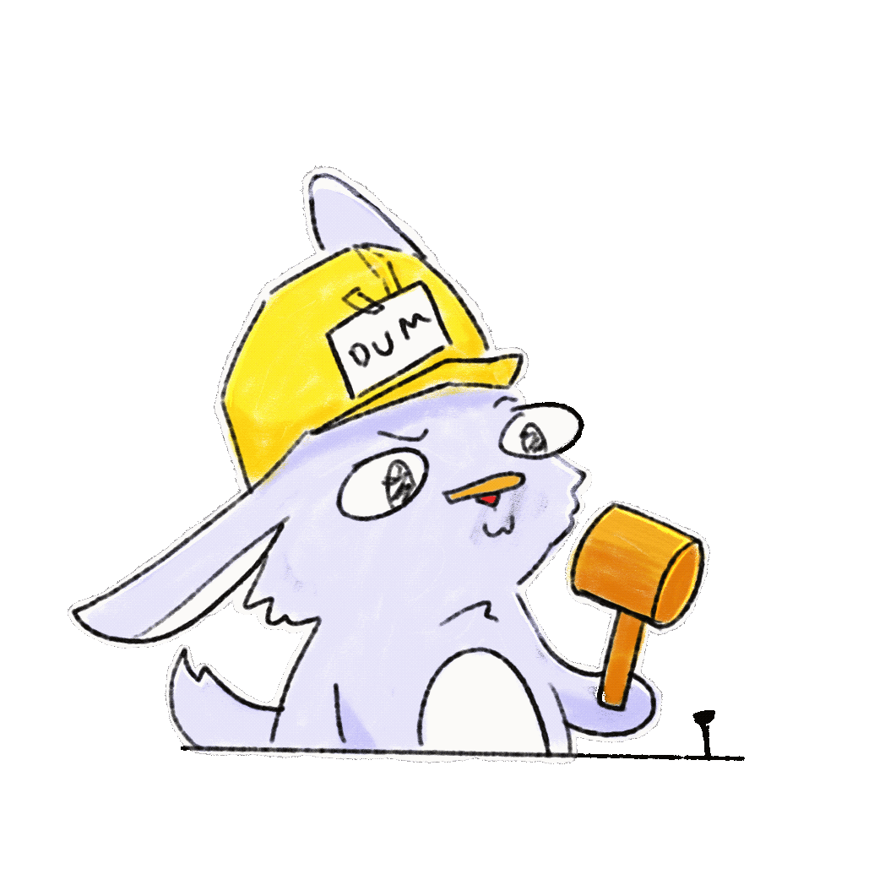

<h1> Hi Welcome!! </h1>

 

## Lil Bit Introduction
ReikutsuNeko here. I have several nicknames like Rei/Ruru (you can call me with whatever comfy). I'm a dev and also an artist. At the moment, to expand my expertise and keep learning stuffs I like, I decided to make a web portfolio. Before I forgot, meet my mascot called Nekogi!! He is the one who actually made this website ~~just kidding orz~~.

    

My plan is to make this project as my portfolio and also as a hub for my other personal projects. Ok, thank you for checking and nice to meet you! Feel free to contact me if you want to collab or do something together.

 

> [!NOTE]
> To run a dev build, `npm run dev` 

> [!IMPORTANT]
> The live website is available at [this link](https://reikutsuneko.github.io/)

## To Do List
- [x] Make base project
- [x] Deploy base project
- [ ] Learn Astro first and foremost
- [ ] Tinkering with Vue
- [ ] Start make a WIP page (for now)
- [ ] Tinkering with TresJS
- [ ] Actually start making a proper portfolio page

### Some references that I use on my project:
- Astro[^1]
- Shields.io[^2]
- Vue.js[^3]
- TresJS[^4]

#### Ref:
[^1]: https://astro.build/  
[^2]: https://shields.io/  
[^3]: https://vuejs.org/  
[^4]: https://tresjs.org/  